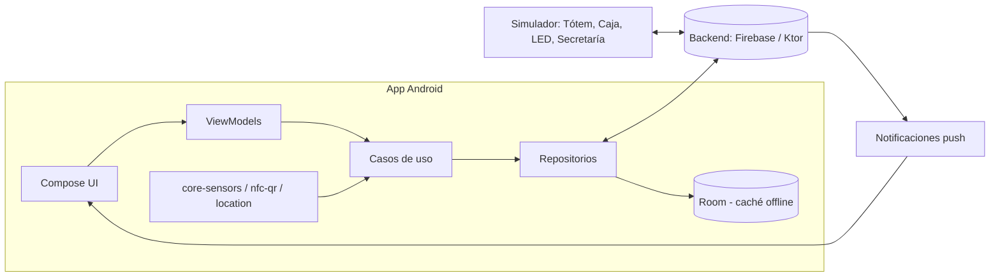
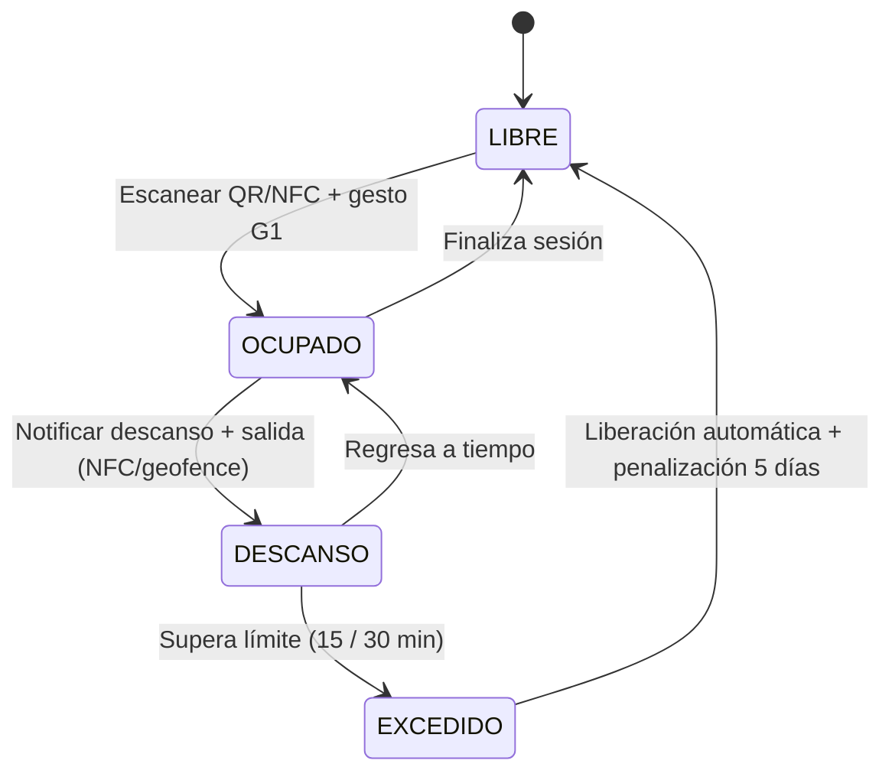
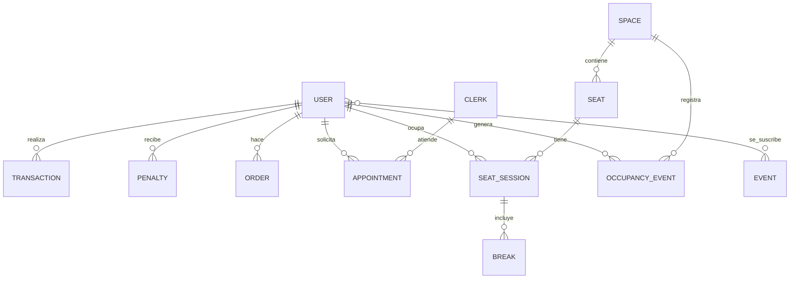

# ETSIIT Smart Campus — Propuesta de proyecto Android

**Asignatura:** Nuevos Paradigmas de Interacción (NPI) · Curso 2026-2027
**Práctica:** Interacción por sensores (Android)
**Entrega:** 08/11/2026 · **Defensa:** 12/11/2026 (demostración de máx. 5 min)
**Grupo:** 5 integrantes · **Estado del documento:** Propuesta para validación con el profesorado

---

## Índice

1. [Resumen ejecutivo](#1-resumen-ejecutivo)
2. [Contexto, problema y objetivos](#2-contexto-problema-y-objetivos)
3. [Alcance del proyecto](#3-alcance-del-proyecto)
4. [Descripción funcional por módulos](#4-descripción-funcional-por-módulos)
5. [Sensores e interacción natural](#5-sensores-e-interacción-natural)
6. [Gestos personalizados](#6-gestos-personalizados)
7. [Arquitectura y stack tecnológico](#7-arquitectura-y-stack-tecnológico)
8. [Modelo de datos y reglas de negocio](#8-modelo-de-datos-y-reglas-de-negocio)
9. [Permisos, plataformas y robustez](#9-permisos-plataformas-y-robustez)
10. [Accesibilidad y multilenguaje](#10-accesibilidad-y-multilenguaje)
11. [Privacidad y ética](#11-privacidad-y-ética)
12. [Reparto del trabajo entre los 5 integrantes](#12-reparto-del-trabajo-entre-los-5-integrantes)
13. [Planificación temporal](#13-planificación-temporal)
14. [Estrategia de pruebas y demo](#14-estrategia-de-pruebas-y-demo)
15. [Riesgos y mitigación](#15-riesgos-y-mitigación)
16. [Correspondencia con los criterios de evaluación](#16-correspondencia-con-los-criterios-de-evaluación)
17. [Entregables](#17-entregables)
18. [Líneas futuras](#18-líneas-futuras)

---

## 1. Resumen ejecutivo

**ETSIIT Smart Campus** es una aplicación Android personalizada que centraliza y automatiza los servicios cotidianos de un estudiante en la ETSIIT: acceso y pago en comedor y cafetería, reserva de puestos de estudio en biblioteca, cita previa en secretaría, información de actividades con guiado hasta el lugar, y control de aforo de los espacios comunes.

El eje del proyecto es la **interacción natural**: el móvil, que siempre acompaña al usuario, sustituye a colas, papeles y tarjetas, y reacciona a **gestos físicos** (dar la vuelta al móvil sobre la mesa para "ocupar" un puesto, asentir con el móvil para aceptar una ruta), a la **proximidad** (NFC/QR en los puestos y accesos) y al **contexto** (ubicación, altura y movimiento).

El proyecto combina **seis tipos de sensores** (NFC, cámara, GPS, barómetro, acelerómetro/giroscopio y proximidad, más Bluetooth LE opcional), todos justificados por una función concreta, y aporta mejoras reales a la ETSIIT: menos colas, mejor aprovechamiento de espacios, información personalizada y mayor equidad en el acceso a recursos.

### Propuesta de valor

| Problema actual | Solución propuesta |
|---|---|
| Colas largas en el comedor y la cafetería | Cola preferente (Comedores+) y pedidos anticipados con pago previo |
| Puestos de biblioteca "reservados" con objetos durante horas | Reserva nominal por puesto, descansos con tiempo límite y liberación automática |
| Citas en secretaría con huecos desaprovechados | Cita previa dinámica basada en la disponibilidad real del personal |
| Desconocimiento de actividades del centro | Informador personalizado con notificaciones y ruta hasta el evento |
| Falta de información de ocupación | Aforo en tiempo real de todos los espacios |

---

## 2. Contexto, problema y objetivos

### 2.1 Contexto

El guion de la práctica solicita desarrollar una *Natural User Interface (NUI)* para la ETSIIT/UGR centrada en las necesidades de un estudiante o visitante externo, con una app Android personalizada, uso justificado de **al menos cuatro sensores distintos y de categorías diversas**, **un gesto propio**, multilenguaje (ES/EN) y accesibilidad.

### 2.2 Objetivo general

Desarrollar una aplicación Android completa y operativa que integre servicios del campus mediante interacción natural basada en sensores del dispositivo.

### 2.3 Objetivos específicos

| ID | Objetivo | Indicador de cumplimiento |
|---|---|---|
| OBJ-1 | Usar ≥ 4 sensores de categorías diversas, cada uno con una función justificada | 6 sensores integrados (sección 5) |
| OBJ-2 | Implementar ≥ 2 gestos propios no estándar | Gestos G1 y G2 (sección 6) |
| OBJ-3 | Cubrir los módulos: TUI, comedor, cafetería, actividades, cita previa, biblioteca y aforo | Todos con flujo completo en la demo |
| OBJ-4 | Aplicación multilenguaje ES/EN | 100 % de textos en `strings.xml` localizados |
| OBJ-5 | Accesible y usable por personas con diversidad funcional | Compatible con TalkBack, escalado de fuente, contraste AA |
| OBJ-6 | Robusta ante fallos (sin red, sin permisos, sensor ausente) | Mensajes al usuario y modo degradado en cada caso |
| OBJ-7 | Proyecto repartible entre 5 personas con módulos independientes | Reparto en sección 12 |

---

## 3. Alcance del proyecto

### 3.1 Dentro del alcance

- Aplicación Android nativa con autenticación y perfil personalizado (estudiante / invitado).
- Monedero virtual **TUI digital** con recarga simulada (Google Pay / efectivo-tarjeta en caja simulada).
- Control de acceso mediante **QR y NFC** (lectura de etiquetas).
- Todos los módulos descritos en la sección 4.
- **Simulador de infraestructura** (tótem, caja, LEDs de puesto): se implementa como una segunda aplicación/módulo Android o panel de administración, ya que no se dispone del hardware real (ver 7.5).
- Backend ligero para sincronizar estado entre usuarios (reservas, aforo, colas, penalizaciones).

### 3.2 Fuera del alcance (se documentará como línea futura)

- Integración real con los sistemas de la UGR (TUI real, secretaría, comedores universitarios), por requerir convenios y credenciales.
- Pasarela de pago real. El pago se **simula** pero con el flujo completo y la arquitectura preparada para sustituirlo.
- Hardware físico de los LED con sensor de proximidad (se simula; ver 7.5).
- Interacción oral completa (se desarrollará en la práctica posterior de Voz; la arquitectura la deja preparada, ver 18).

> **Nota de viabilidad técnica sobre la TUI.** La TUI real es una tarjeta sin contacto cuyo protocolo no es público y que un móvil Android no puede emular (HCE no admite clonar una tarjeta propietaria). Por ello la app implementa una **TUI digital propia** que se identifica mediante un **QR dinámico firmado y de caducidad corta** y/o un servicio **HCE propio** compatible con el lector del simulador. Esta decisión debe constar en la memoria como supuesto de diseño.

---

## 4. Descripción funcional por módulos

Se identifican los requisitos con el prefijo **RF-** (funcional) para trazabilidad en memoria y pruebas.

### 4.1 Módulo 0 — Cuenta, perfil y TUI digital (transversal)

**Descripción:** Autenticación, perfil personalizado y monedero.

| ID | Requisito |
|---|---|
| RF-0.1 | Registro/login con correo institucional (estudiante) o modo **invitado** con DNI/NIF. |
| RF-0.2 | Perfil con idioma, preferencias de actividades y opciones de accesibilidad. |
| RF-0.3 | **Monedero TUI:** saldo, historial de movimientos y QR/NFC de identificación. |
| RF-0.4 | Recarga de saldo mediante Google Pay (simulado) y recarga en caja simulada. |
| RF-0.5 | Panel de **penalizaciones activas** (biblioteca, comedor, cita) con fecha de fin. |
| RF-0.6 | Funcionamiento de la identificación también sin conexión (QR firmado en caché con caducidad). |

**Usos de la TUI:** entrar al comedor, controlar aforo, pagar, salir, bonobús (representado como saldo/pase añadido).

### 4.2 Módulo 1 — Comedor y suscripción *Comedores+*

| ID | Requisito |
|---|---|
| RF-1.1 | Consultar menú del día, alérgenos y precio. |
| RF-1.2 | Entrada/salida registrada mediante QR/NFC (alimenta el aforo). |
| RF-1.3 | Cola **estándar** y cola **preferente** (suscripción *Comedores+*). |
| RF-1.4 | Suscripción *Comedores+* con alta/baja y cobro desde el monedero. |
| RF-1.5 | **Tiempo máximo de permanencia** en el comedor (p. ej. 45 min), con aviso previo a los 5 min. |
| RF-1.6 | Si se excede el tiempo: **una semana sin preferencia** en la cola. |
| RF-1.7 | Mostrar estimación de espera y aforo actual. |

### 4.3 Módulo 2 — Cafetería: pedidos desde el móvil

| ID | Requisito |
|---|---|
| RF-2.1 | Carta con productos, categorías, precios y disponibilidad. |
| RF-2.2 | Crear pedido, **pagarlo con TUI** y recibir un **ID de pedido** único. |
| RF-2.3 | Seguimiento del estado: *Recibido → En preparación → Listo → Entregado*. |
| RF-2.4 | Notificación al estar listo. |
| RF-2.5 | **Tótem** (simulado) para usuarios sin TUI: pedido y pago, integrándose en la **misma cola**. |
| RF-2.6 | Historial y repetición de pedidos. |

### 4.4 Módulo 3 — Actividades de la ETSIIT

| ID | Requisito |
|---|---|
| RF-3.1 | Listado de actividades de la semana (charlas, cursos, talleres). |
| RF-3.2 | Suscripción por categorías/preferencias y **notificaciones personalizadas**. |
| RF-3.3 | Añadir actividad a la agenda del dispositivo (Calendar Provider) con recordatorio. |
| RF-3.4 | **Ruta hasta el lugar**: interior del edificio (planta, aula) y exterior (GPS). |
| RF-3.5 | **Gesto "Sí"** (G2): tras leer la actividad, asentir con el móvil activa la ruta inmediatamente. |
| RF-3.6 | Detección de cambio de planta mediante barómetro para actualizar las indicaciones. |

### 4.5 Módulo 4 — Cita previa dinámica en secretaría

| ID | Requisito |
|---|---|
| RF-4.1 | Solicitud de cita por tipo de trámite (certificado, convalidación, prácticas, Erasmus…). |
| RF-4.2 | Calendario de huecos disponibles y confirmación con recordatorio. |
| RF-4.3 | **Cita dinámica:** si no hay huecos pero el sistema detecta un secretario ocioso, se ofrece una **cita inmediata** ("¿Puedes venir ahora?"), con confirmación en 10 minutos. |
| RF-4.4 | Estado de cada puesto de atención (*Libre / Atendiendo*) actualizado desde el panel de administración simulado. |
| RF-4.5 | **Penalización:** no asistir a una cita sin cancelarla = **1 semana** sin poder pedir cita. |
| RF-4.6 | Cancelación con antelación mínima sin penalización. |
| RF-4.7 | Check-in de asistencia al llegar (NFC/QR en la puerta de secretaría o geofence). |

### 4.6 Módulo 5 — Biblioteca y salas de estudio

Es el módulo con mayor carga de sensores y de reglas de negocio.

**Reserva y asignación de puesto**

| ID | Requisito |
|---|---|
| RF-5.1 | Reserva **nominal** de un puesto concreto (un puesto por persona). |
| RF-5.2 | Mapa de la sala con estado de cada puesto. |
| RF-5.3 | Acceso de invitados con DNI/NIF; el **tótem** asigna puesto elegido entre los libres. |
| RF-5.4 | Cada puesto tiene una pegatina con **QR + NFC** (mismo identificador). |
| RF-5.5 | **Gesto G1 "Estoy estudiando"**: escanear QR/NFC, girar el móvil y dejarlo boca abajo en la mesa confirma la ocupación del puesto. |

**Descansos**

| ID | Requisito |
|---|---|
| RF-5.6 | El usuario notifica el descanso y sale; la salida se detecta al **tocar la etiqueta NFC** del puesto o del acceso (o por geofence si falla NFC). |
| RF-5.7 | El sistema **clasifica el descanso** por ubicación del móvil: |
|  | • **Necesario** (baño, retirar libros, secretaría…): **30 min** desde que sale de la biblioteca. |
|  | • **Lúdico** (cafetería, salir de la facultad…): **15 min**. |
| RF-5.8 | Cuenta atrás visible, notificación a los 5 min del final y botón de **ampliar por causa justificada** (ver 11.2). |
| RF-5.9 | Si se vuelve al puesto en plazo (nuevo escaneo NFC/QR o gesto G1) el descanso se cierra. |

**Estados del puesto (LED simulado)**

| Color | Estado | Significado |
|---|---|---|
| 🟢 Verde | `LIBRE` | Puesto disponible |
| 🟠 Naranja | `DESCANSO` | Reservado en periodo de descanso |
| 🔴 Rojo fijo | `OCUPADO` | Puesto en uso |
| 🔴 Rojo parpadeante | `EXCEDIDO` | Se superó el límite de descanso |

> Para cumplir accesibilidad, **el estado nunca se comunica solo con el color**: se añade icono, texto y descripción para TalkBack.

**Incumplimiento**

| ID | Requisito |
|---|---|
| RF-5.10 | Si se excede el tiempo y no se ha vuelto, el puesto pasa a `EXCEDIDO`, se **libera** y se notifica al personal para retirar pertenencias. |
| RF-5.11 | **Penalización:** 5 días sin acceso a esa biblioteca. |
| RF-5.12 | Las pertenencias se recogen **identificándose en persona** (estado "Pertenencias custodiadas" visible en la app). |

### 4.7 Módulo 6 — Control de aforo de espacios

| ID | Requisito |
|---|---|
| RF-6.1 | Registro de entrada y salida (TUI o identificador de invitado) en cafetería, comedor, biblioteca y salas de estudio. |
| RF-6.2 | Aforo en tiempo real por espacio (ocupación / capacidad, con nivel *bajo-medio-alto-completo*). |
| RF-6.3 | Reutilización del mismo subsistema en espacios que ya requerían identificación (sin doble fichaje). |
| RF-6.4 | Gráfica de afluencia por franja horaria (histórico) para recomendar mejores momentos. |
| RF-6.5 | Notificación opcional "avísame cuando haya sitio" en un espacio completo. |
| RF-6.6 | Corrección de fichajes olvidados (salida automática por geofence/tiempo máximo). |

---

## 5. Sensores e interacción natural

El guion exige que **cada sensor esté justificado por la funcionalidad** y valora la **diversidad de categorías**. El proyecto incluye seis sensores con una función propia y no redundante.

| # | Sensor | Categoría | Función concreta | Módulo | Modo degradado si no está |
|---|---|---|---|---|---|
| 1 | **NFC** | Comunicación proximidad | Lectura de etiquetas de puesto/accesos; fichaje de entrada/salida; detección de salida de un descanso | 5, 6, 1 | Usar QR |
| 2 | **Cámara** | Visión | Lectura de QR de puesto, de acceso y de pedido | 0, 1, 5, 6 | Introducción manual del código |
| 3 | **GPS / Ubicación** | Posición | Geofencing, clasificar tipo de descanso (necesario vs. lúdico), ruta exterior | 3, 5, 6 | Selección manual de lugar |
| 4 | **Barómetro** | Entorno/Posición | Detectar la **planta** del usuario → ubicación con altura; guiado interior por plantas | 3, 5 | Preguntar planta al usuario |
| 5 | **Acelerómetro + giroscopio (IMU)** | Movimiento | Reconocer gestos G1 y G2 con una máquina de estados sobre ambas señales | 3, 5 | Botón alternativo en pantalla |
| 6 | **Proximidad** | Entorno | Confirmar que el móvil está **tapado boca abajo** sobre la mesa (refuerzo del gesto G1 y reducción de falsos positivos) | 5 | Solo IMU |
| (+) | **Bluetooth LE** *(opcional)* | Comunicación | Balizas para refinar la ubicación indoor y la clasificación del descanso | 5, 3 | GPS + barómetro |
| (+) | **Multitáctil** | Interacción | Zoom/desplazamiento del mapa de sala y del plano de planta | 3, 5 | — |

**Diversidad de categorías:** comunicación (NFC/BLE), visión (cámara), posición (GPS), entorno (barómetro, proximidad) y movimiento (IMU) → cinco categorías distintas, superando el mínimo de cuatro sensores.

### 5.1 Fusión de sensores para la ubicación del descanso

Para clasificar un descanso se combina:

```
Ubicación final = f( GPS (lat/lon), Barómetro (planta), geofences del edificio, [BLE opcional] )
```

Pseudocódigo del clasificador:

```kotlin
fun classifyBreak(zone: Zone): BreakType = when (zone) {
    Zone.RESTROOM, Zone.BOOK_DESK, Zone.SECRETARIAT, Zone.PRINT_ROOM -> BreakType.NECESSARY  // 30 min
    Zone.CAFETERIA, Zone.OUTSIDE_FACULTY, Zone.VENDING               -> BreakType.LEISURE    // 15 min
    else -> BreakType.UNKNOWN // se aplica el límite más restrictivo y se pide confirmación al usuario
}
```

El **reloj del descanso** se inicia al detectar la salida (NFC/geofence) y el límite depende del tipo detectado; si el usuario cambia de zona (p. ej. de baño a cafetería) se re-evalúa aplicando siempre el límite más restrictivo ya vivido, para evitar manipulación.

---

## 6. Gestos personalizados

El guion obliga a desarrollar **al menos un gesto propio**, consultado con el profesor. Se proponen dos de complejidad media.

### G1 — Gesto "Estoy estudiando" (voltear y dejar boca abajo)

- **Propósito:** confirmar la ocupación de un puesto de forma rápida y sin tocar la pantalla.
- **Secuencia:** (1) escanear QR/NFC del puesto → (2) **rotar el móvil 180°** sobre su eje largo → (3) **depositarlo boca abajo** y quieto sobre la mesa.
- **Detección:**
  - Giroscopio: rotación acumulada ≈ 180° en una ventana de ≤ 3 s.
  - Acelerómetro: eje Z ≈ **−9,8 m/s²** sostenido (≥ 1,5 s) y varianza baja (móvil quieto).
  - Proximidad: sensor **cercano** (tapado) como confirmación.
- **Feedback:** vibración corta, sonido discreto y pantalla de confirmación antes de apagarse.
- **Justificación:** representa el acto natural de "dejar el móvil" mientras se estudia (además, fomenta no distraerse) y sustituye una confirmación en pantalla.

### G2 — Gesto "Sí" (asentimiento con el móvil)

- **Propósito:** aceptar la ruta hacia una actividad tras leerla.
- **Secuencia:** inclinar el móvil hacia delante y volver (cabeceo) **dos veces** seguidas.
- **Detección:** oscilación en el eje de *pitch* del giroscopio con umbrales de velocidad angular (±1,5 rad/s) y 2 ciclos en < 1,5 s, validando con el acelerómetro que no es simple movimiento de caminar (filtro paso-bajo + comprobación de cadencia).
- **Feedback:** vibración doble y comienzo inmediato de la ruta.
- **Justificación:** reproduce el gesto humano universal de asentir, evita la pulsación de un botón y resulta muy útil para personas con dificultades motoras finas.

### Implementación

- Clase `GestureRecognizer` basada en **máquina de estados finitos** (`Idle → Candidate → Confirmed / Rejected`) con ventana deslizante de muestras.
- Frecuencia de muestreo `SENSOR_DELAY_GAME` (~50 Hz); procesado en un `Flow` sobre `Dispatchers.Default`.
- Umbrales ajustables en una pantalla de **calibración** (útil para la demo en distintos móviles).
- Alternativa accesible siempre disponible (botón equivalente).

> **Acción previa necesaria:** validar G1 y G2 con el profesor antes de la implementación para evitar que se consideren demasiado simples o complejos.

---

## 7. Arquitectura y stack tecnológico

### 7.1 Decisiones técnicas

| Aspecto | Decisión | Justificación |
|---|---|---|
| Lenguaje | **Kotlin** (con corrutinas y Flow) | Lenguaje oficial de Android, conciso y seguro |
| UI | **Jetpack Compose** + Material 3 | Interfaz declarativa, accesibilidad integrada, temas |
| Arquitectura | **MVVM + Clean Architecture** (capas *ui / domain / data*) | Módulos desacoplados → trabajo en paralelo |
| Navegación | Navigation Compose | Rutas tipadas por módulo |
| Inyección de dependencias | **Hilt** | Facilita pruebas y reparto del trabajo |
| Persistencia local | **Room** (SQLite) + **DataStore** | Modo offline y preferencias |
| Red | **Retrofit + OkHttp + kotlinx.serialization** | Cliente REST estándar |
| Backend | **Firebase** (Auth, Firestore, Cloud Messaging) *o* servidor **Ktor** en Kotlin | Sincronización en tiempo real y notificaciones; ver 7.4 |
| Segundo plano | **WorkManager**, *Foreground Service* (descansos) y **Geofencing API** | Cuenta atrás y detección con la app cerrada |
| Notificaciones | FCM + `NotificationManager` con canales | Avisos de actividades, descansos y pedidos |
| Mapas | **osmdroid / MapLibre** (OpenStreetMap) + capa propia de planos interiores en SVG/PNG | Sin dependencia de claves de pago; planos indoor propios |
| Ubicación | Fused Location Provider (Google Play Services) | Ubicación precisa y eficiente |
| QR | **CameraX + ML Kit Barcode Scanning** | Lectura rápida y offline |
| NFC | `NfcAdapter` (*reader mode*) y NDEF; HCE propio para identificación | API nativa de Android |
| Pagos | **Google Pay API (modo TEST)** | Recarga simulada realista |
| Calendario | Calendar Provider | Agenda de actividades |
| Localización | `strings.xml` (es / en) con `values-es` y `values-en` | Requisito del guion |
| Testing | JUnit5, MockK, Turbine, Compose UI Test, Espresso | Calidad y regresión |
| Control de versiones | **Git** (GitHub/GitLab) con *GitFlow* simplificado | Trabajo de 5 personas; la entrega final va comprimida en PRADO |
| CI | GitHub Actions (build + tests + lint) | Detección temprana de errores |

### 7.2 Versiones y plataformas

- **minSdk 26** (Android 8.0) — cubre > 95 % de dispositivos y permite canales de notificación y APIs modernas.
- **targetSdk / compileSdk: 35 o la última estable disponible** — se fijará al inicio tras verificar compatibilidad de librerías.
- **IDE:** Android Studio (última versión estable). **Build:** Gradle con Kotlin DSL y *version catalog*.
- Dispositivos de prueba: móviles de los integrantes (se documentará modelo y versión de Android) + emuladores.

### 7.3 Estructura del proyecto (multimódulo)

```
etsiit-smartcampus/
├── app/                      # Application, navegación raíz, Hilt, tema
├── core/
│   ├── core-common/          # Result, utilidades, constantes de reglas (tiempos, penalizaciones)
│   ├── core-ui/              # Componentes Compose, tema, accesibilidad, i18n
│   ├── core-data/            # Retrofit, Room base, repositorios compartidos
│   ├── core-sensors/         # Wrappers de sensores (IMU, proximidad, barómetro) + GestureRecognizer
│   ├── core-nfc-qr/          # Lectura NFC (reader mode) y QR (CameraX + ML Kit)
│   └── core-location/        # Geofencing, fusión GPS+barómetro, clasificación de zonas
├── feature/
│   ├── feature-auth-wallet/  # Módulo 0: perfil, TUI, monedero, penalizaciones
│   ├── feature-dining/       # Módulos 1 y 2: comedor, Comedores+, cafetería
│   ├── feature-library/      # Módulo 5: biblioteca, descansos, G1
│   ├── feature-events/       # Módulo 3: actividades, rutas, G2
│   ├── feature-appointments/ # Módulo 4: cita previa dinámica
│   └── feature-occupancy/    # Módulo 6: aforo y estadísticas
├── simulator/                # App/módulo "Totem & Admin": tótem, caja, LEDs y panel de secretaría
├── backend/                  # (si se opta por Ktor) API REST + WebSocket
└── docs/                     # Memoria, diagramas, vídeo
```

Cada `feature-*` sigue la estructura interna:

```
feature-xxx/
├── ui/        # Screens (Compose), ViewModels, UiState
├── domain/    # Modelos, casos de uso (UseCase), interfaces de repositorio
└── data/      # Implementación de repositorios, DTOs, DAOs, mappers
```

### 7.4 Backend: dos opciones

| Opción | Pros | Contras | Recomendación |
|---|---|---|---|
| **A. Firebase** (Auth + Firestore + FCM) | Rápido, tiempo real, notificaciones push incluidas, sin servidor propio | Dependencia de terceros y cuota gratuita | **Recomendada** por el calendario ajustado |
| **B. Ktor propio** (Kotlin + SQLite/PostgreSQL + WebSocket) | Control total, mismo lenguaje | Más trabajo de despliegue y mantenimiento | Alternativa si se prohíbe Firebase |

Con cualquiera de las dos, el acceso se oculta tras interfaces `Repository` para poder cambiar de implementación sin tocar la UI. Se incluirá una **implementación *fake* en memoria** para demo sin conexión y pruebas.

### 7.5 Simulación de infraestructura física

Como no se dispone de tótems, cajas ni LEDs con sensor, se desarrolla el módulo `simulator` (segunda app o *flavor* de la misma):

| Elemento real | Simulación |
|---|---|
| Tótem de biblioteca / cafetería | Pantalla de tótem (modo kiosco) que identifica por DNI/NIF, asigna puesto y registra pedidos |
| Caja del comedor/cafetería | Pantalla de cobro y recarga de TUI |
| LED por puesto | Mapa de puestos con colores/iconos en tiempo real y evento "pasar a EXCEDIDO" |
| Pegatina QR+NFC | QR impreso + **etiquetas NFC NTAG213/215** (económicas) con el ID del puesto en NDEF |
| Sensor de proximidad del puesto | Evento manual en el simulador (o segundo móvil) |
| Panel de secretaría | Interruptores *Libre/Ocupado* por cada secretario |

Esto permite una demostración **completa y reproducible** en 5 minutos con 2–3 móviles.

### 7.6 Diagrama de componentes (alto nivel)



### 7.7 Máquina de estados del puesto de biblioteca



---

## 8. Modelo de datos y reglas de negocio

### 8.1 Entidades principales



| Entidad | Campos clave |
|---|---|
| `User` | id, nombre, rol (`STUDENT`/`GUEST`), idioma, `hasComedoresPlus`, preferencias, ajustes de accesibilidad |
| `Wallet / Transaction` | saldo, importe, tipo (recarga, comida, pedido, suscripción), fecha |
| `Penalty` | userId, tipo (`LIBRARY`, `DINING_PRIORITY`, `APPOINTMENT`), inicio, fin, motivo |
| `Order` / `OrderItem` | id corto legible, estado, total, canal (`APP`/`TOTEM`), cola |
| `Event` | título, descripción, categoría, lugar (planta + coordenadas), fecha/hora |
| `Appointment` | tipo de trámite, hueco, estado (`BOOKED`, `DYNAMIC_OFFER`, `ATTENDED`, `NO_SHOW`, `CANCELLED`), secretario |
| `Space` / `Seat` | tipo, capacidad, planta, estado de cada puesto, id de etiqueta NFC/QR |
| `SeatSession` / `Break` | inicio, fin, tipo de descanso, límite, hora de salida, resultado |
| `OccupancyEvent` | espacio, usuario, entrada/salida, marca de tiempo |

### 8.2 Reglas parametrizables

Todas las reglas se centralizan en un único archivo de configuración (`BusinessRules.kt` / configuración remota) para poder modificarlas en la demo sin recompilar lógica:

| Regla | Valor por defecto |
|---|---|
| Descanso necesario | 30 min |
| Descanso lúdico | 15 min |
| Penalización por exceder descanso en biblioteca | 5 días sin acceso a esa biblioteca |
| Penalización por exceder tiempo en comedor (Comedores+) | 7 días sin cola preferente |
| Penalización por no asistir a cita | 7 días sin poder pedir cita |
| Tiempo máximo de permanencia en comedor | 45 min |
| Aviso previo a un límite | 5 min antes |
| Cancelación de cita sin penalización | ≥ 2 h antes |
| Caducidad del QR dinámico de la TUI | 60 s |
| Oferta de cita dinámica: tiempo de aceptación | 10 min |

> **Modo demo:** se incluirá un multiplicador de tiempo (p. ej. 1 min = 1 s) para mostrar penalizaciones durante la defensa de 5 minutos.

### 8.3 Cola de comedor y cafetería

- Estructura: **cola de prioridad** (`PriorityQueue`) ordenada por `(prioridad, instante de llegada)`.
- Prioridad 0 = Comedores+ sin penalización; prioridad 1 = resto.
- Pedidos de cafetería (app y tótem) comparten la misma cola ordenada por instante de creación.

### 8.4 Cita dinámica

```
Cada N segundos:
   para cada secretario con estado LIBRE durante > T (p. ej. 3 min) y sin cita asignada:
       si hay usuarios con solicitud pendiente "aviso inmediato" o sin hueco:
            enviar oferta de cita dinámica al primero (FIFO) con caducidad de 10 min
```

---

## 9. Permisos, plataformas y robustez

### 9.1 Permisos y gestión

| Permiso | Uso | Momento de solicitud |
|---|---|---|
| `CAMERA` | Escaneo QR | Al abrir el escáner (con explicación previa) |
| `NFC` (*normal*) | Lectura de etiquetas | Instalación (declarado en manifiesto) |
| `ACCESS_FINE_LOCATION` | Geofencing y ruta | Al activar el módulo que lo necesita |
| `ACCESS_BACKGROUND_LOCATION` | Detección de descansos con la app en segundo plano | Solo si el usuario acepta el modo "descansos automáticos" |
| `POST_NOTIFICATIONS` (Android 13+) | Avisos | Tras el primer uso relevante |
| `FOREGROUND_SERVICE_LOCATION` | Cuenta atrás activa | Al iniciar un descanso |
| `BLUETOOTH_SCAN` / `CONNECT` (opcional) | Balizas BLE | Solo si se activa |
| `VIBRATE`, `INTERNET`, `ACCESS_NETWORK_STATE` | Feedback y red | Instalación |
| `READ/WRITE_CALENDAR` | Agenda de actividades | Al pulsar "añadir a agenda" |

Principios: **solicitud contextual**, explicación previa (*rationale*) y **degradación elegante** si se deniega (nunca se bloquea la app).

### 9.2 Compatibilidad

Se documentará una **matriz de dispositivos** (modelo, Android, sensores disponibles). La app detecta en ejecución qué sensores existen (`SensorManager.getDefaultSensor`) y activa alternativas si falta alguno (p. ej. móviles sin barómetro).

### 9.3 Robustez frente a fallos

| Situación | Comportamiento |
|---|---|
| Sin Internet | Banner "Sin conexión"; QR de TUI y reservas recientes disponibles desde caché; las operaciones críticas se encolan (WorkManager) o se informa de que no pueden realizarse |
| Permiso denegado | Pantalla explicativa y acceso alternativo manual |
| NFC desactivado | Diálogo con acceso directo a ajustes y alternativa QR |
| GPS desactivado / sin señal | Selección manual del lugar y aviso en la clasificación del descanso |
| Sensor ausente | Botón alternativo para el gesto |
| Reinicio del móvil durante un descanso | El *foreground service* y la hora de salida se restauran desde Room |
| Fallo del backend | Mensaje claro y reintentos con *backoff* |
| Conflictos de reserva | Control transaccional en el servidor (el último en llegar recibe un mensaje de "puesto ya ocupado") |

---

## 10. Accesibilidad y multilenguaje

### 10.1 Multilenguaje (ES / EN)

- Todos los textos en `res/values/strings.xml` (ES por defecto) y `res/values-en/strings.xml`.
- Plurales, fechas, horas y moneda con `Locale`; **selector de idioma** dentro de la app (`AppCompatDelegate.setApplicationLocales`).
- Contenidos dinámicos (menú, actividades) con campos `title_es` / `title_en`.
- Diseñado para ampliar fácilmente a otros idiomas.

### 10.2 Accesibilidad (valorada muy positivamente)

| Medida | Detalle |
|---|---|
| **TalkBack** | `contentDescription`, `semantics` y orden de foco lógicos en Compose; anuncios de cambios de estado (`liveRegion`) |
| **No depender solo del color** | Estados de puesto con icono + texto + color (apto para daltonismo) |
| **Contraste** | Cumplir **WCAG 2.1 AA** (≥ 4,5:1) y modo oscuro |
| **Tamaño** | Soporte de escalado de fuente del sistema hasta 200 % y áreas táctiles ≥ 48 dp |
| **Alternativas a los gestos** | Cada gesto tiene un botón equivalente (importante para movilidad reducida) |
| **Feedback múltiple** | Vibración, sonido y visual combinados |
| **Tiempos ampliables** | Perfil con **tiempos de descanso ampliados** para personas con movilidad reducida u otras necesidades (previa acreditación) |
| **Lenguaje claro** | Mensajes cortos y sin ambigüedad |
| **Modo de ruta accesible** | Rutas que evitan escaleras (ascensores/rampas) como opción |
| **Futuro: voz** | Arquitectura preparada para integrar el asistente de voz (práctica posterior) |

Se ejecutará el **Accessibility Scanner** de Google y se documentarán los resultados en la memoria.

---

## 11. Privacidad y ética

### 11.1 Protección de datos (RGPD)

- **Minimización:** la ubicación solo se usa mientras hay un descanso activo o una ruta en curso.
- **Consentimiento explícito** y revocable para ubicación en segundo plano.
- Los datos de ubicación **no se almacenan** más allá de la clasificación del descanso (se guarda únicamente el tipo resultante).
- Identificadores de invitado (DNI/NIF) **cifrados** y eliminados tras un periodo definido.
- Transmisión mediante HTTPS/TLS; tokens de sesión en `EncryptedSharedPreferences`.
- Pantalla de **política de privacidad** y descarga/borrado de datos del usuario.

### 11.2 Equidad en las penalizaciones

Las sanciones automáticas pueden resultar injustas en casos de fuerza mayor. Se incluye:

- Botón **"Imprevisto / causa justificada"** que amplía el descanso una vez, con registro para revisión.
- **Procedimiento de reclamación** desde la app.
- **Tiempos ampliados** para usuarios con diversidad funcional (ver 10.2).
- Aviso previo en cada penalización y panel que muestra claramente el motivo y el fin.

---

## 12. Reparto del trabajo entre los 5 integrantes

Los módulos son independientes gracias a la arquitectura multimódulo, lo que minimiza conflictos de Git. Cada persona es **responsable principal** de un bloque y **apoyo** de otro.

| Rol | Responsable principal | Entregables clave | Apoyo a |
|---|---|---|---|
| **P1 — Líder técnico / Núcleo y TUI** | `app`, `core-common`, `core-data`, `core-ui`, `feature-auth-wallet`, backend/Firebase, CI, localización ES/EN | Arquitectura base, login/perfil, monedero TUI + QR dinámico, recarga Google Pay (test), panel de penalizaciones, esquema de datos, pipeline CI, selector de idioma | Integración final, revisión de código |
| **P2 — Restauración** | `feature-dining` + parte del `simulator` (tótem y caja) | Menú, entrada/salida del comedor, cola preferente, Comedores+, tiempo máximo y penalización, pedidos de cafetería con ID y estados, tótem | P1 (pagos), P5 (aforo) |
| **P3 — Biblioteca y gestos IMU** | `feature-library`, `core-sensors` (G1), simulador de LED | Reserva de puesto, mapa de sala, NFC/QR por puesto, **gesto G1**, descansos con clasificación, foreground service de cuenta atrás, estados del LED, liberación y penalización de 5 días | P4 (gesto G2, `GestureRecognizer` común) |
| **P4 — Actividades, ubicación y rutas** | `feature-events`, `core-location`, parte de `core-sensors` (G2, barómetro) | Listado/suscripción de actividades, notificaciones personalizadas, agenda, **gesto G2 "Sí"**, rutas interior/exterior, planos por planta, geofences, barómetro | P3 (clasificación de zonas) |
| **P5 — Servicios administrativos, aforo y calidad** | `feature-appointments`, `feature-occupancy`, panel de secretaría (simulador), `core-nfc-qr` | Cita previa estándar y dinámica, penalización por no asistir, check-in, aforo en tiempo real e histórico, lector QR/NFC reutilizable, accesibilidad (auditoría), pruebas de integración | Todos (QA y accesibilidad) |

### 12.1 Tareas compartidas (todo el equipo)

| Tarea | Coordinador |
|---|---|
| Memoria técnica (cada uno redacta su módulo y su aportación) | P1 |
| Diagramas (UML, E/R, flujos) | Cada responsable de módulo |
| Videotutorial (guion, grabación y edición) | P5 (con colaboración de todos) |
| Preparación y ensayo de la defensa de 5 min | P2 |
| Revisión de accesibilidad e idiomas | P5 y P1 |
| Gestión del tablero de tareas (Trello/GitHub Projects) | P1 |

> **Requisito del guion:** la memoria debe indicar **qué ha hecho cada miembro**; se mantendrá un registro de tareas (con commits y *pull requests* por autor) para documentarlo de forma detallada.

### 12.2 Convenciones de equipo

- Ramas: `main` (estable) ← `develop` ← `feature/<modulo>-<tarea>`.
- Todo cambio mediante *Pull Request* con al menos 1 revisión.
- Estilo de código: **ktlint/detekt**; comentarios KDoc en clases y funciones públicas (exigencia del guion).
- Commits convencionales (`feat:`, `fix:`, `docs:`).
- Reunión breve (*daily*) de 10 min y revisión semanal.
- Cuidar la **autoría y licencias** de librerías externas (registro en `THIRD_PARTY_LICENSES.md`).

---

## 13. Planificación temporal

Fecha de entrega: **08/11/2026** (defensa 12/11). Fecha de la propuesta: 06/10/2026 → **~5 semanas**.

| Fase | Fechas | Objetivo | Hito |
|---|---|---|---|
| **Sprint 0 — Preparación** | 06/10 – 11/10 | Validar propuesta y gestos con el profesor; repositorio, proyecto multimódulo, CI, diseño UI (Figma), contrato de la API y datos *fake* | Esqueleto compilable y navegación base |
| **Sprint 1 — Núcleo funcional** | 12/10 – 25/10 | Auth + TUI (P1), sensores y lectura NFC/QR (P5), reserva y estados de biblioteca (P3), comedor y pedidos básicos (P2), actividades y mapa (P4) | Cada módulo con su flujo principal **sin reglas avanzadas** |
| **Sprint 2 — Reglas, gestos e integración** | 26/10 – 04/11 | Gestos G1 y G2, descansos + penalizaciones, cola preferente, cita dinámica, aforo, rutas con barómetro, simulador, i18n completo | **Feature freeze (04/11)** |
| **Sprint 3 — Cierre y entrega** | 05/11 – 08/11 | Pruebas en dispositivos reales, accesibilidad, corrección de errores, memoria, vídeo y empaquetado para PRADO | **Entrega 08/11** |
| **Defensa** | 12/11 | Demo de 5 min con móviles del equipo | — |

### 13.1 Priorización (por si el tiempo aprieta)

| Prioridad | Contenido |
|---|---|
| **MUST** | Perfil + TUI digital, biblioteca completa (reserva, descanso, gesto G1, penalización), aforo, actividades con ruta y gesto G2, ES/EN, ≥ 4 sensores, manejo de errores |
| **SHOULD** | Comedor con Comedores+, cafetería con pedidos y tótem, cita previa dinámica, historial de aforo, accesibilidad avanzada |
| **COULD** | BLE para ubicación indoor, Google Pay completo, estadísticas, modo ruta sin escaleras, calibración de gestos |

### 13.2 Guion de la demo (5 min)

1. (0:00) Login y perfil → TUI/QR (P1).
2. (0:40) Pedido de cafetería con pago y notificación de "listo" (P2).
3. (1:20) Biblioteca: escanear NFC, **gesto G1**, ver el LED naranja/rojo en el simulador al hacer un descanso (P3).
4. (2:30) Actividad → leer → **gesto G2** y ruta con cambio de planta (P4).
5. (3:30) Cita dinámica: secretario ocioso → oferta inmediata (P5).
6. (4:15) Aforo en tiempo real y cambio de idioma EN/ES.
7. (4:45) Cierre y mención de accesibilidad.

---

## 14. Estrategia de pruebas y demo

| Nivel | Herramientas | Qué se prueba |
|---|---|---|
| **Unitarias** | JUnit5, MockK, Turbine | Reglas de negocio (tiempos, penalizaciones, colas, clasificación de descanso), `GestureRecognizer` con trazas de sensores grabadas |
| **Integración** | Room in-memory, MockWebServer | Repositorios y sincronización offline/online |
| **UI** | Compose UI Test, Espresso | Flujos de usuario, textos ES/EN, semántica de accesibilidad |
| **Sensores en dispositivo** | Pruebas manuales guiadas + registro de trazas | Gestos en ≥ 3 modelos distintos; cambios de planta; NFC/QR en condiciones reales |
| **Accesibilidad** | TalkBack, Accessibility Scanner | Navegación completa sin ver la pantalla; contraste y tamaños |
| **Robustez** | Modo avión, permisos denegados, rotación, batería baja | Mensajes y recuperación sin cierres inesperados |

**Criterios de aceptación de gestos:** ≥ 90 % de aciertos en 20 ejecuciones y ≤ 5 % de falsos positivos al caminar/guardar el móvil en el bolsillo.

---

## 15. Riesgos y mitigación

| Riesgo | Prob. | Impacto | Mitigación |
|---|---|---|---|
| Alcance excesivo para ~5 semanas | Alta | Alto | Priorización MUST/SHOULD/COULD, *feature freeze* y datos simulados |
| Gestos poco fiables en distintos móviles | Media | Alto | Pantalla de calibración, umbrales configurables, botón alternativo y pruebas con trazas |
| Sensores no disponibles (barómetro, NFC) | Media | Medio | Detección en tiempo de ejecución y modos degradados |
| Detección de descansos en segundo plano limitada por Android (ahorro de batería) | Alta | Medio | *Foreground service* con notificación visible, geofencing y NFC como señal principal |
| Falta de hardware real (tótem, LED) | Cierta | Medio | Módulo `simulator` + etiquetas NFC económicas |
| Dependencia de Firebase/cuotas o conexión durante la defensa | Media | Alto | Implementación *fake* local y datos precargados para la demo |
| Conflictos en Git por trabajo paralelo | Media | Medio | Arquitectura multimódulo, PR obligatorios y *rebase* frecuente |
| Imposibilidad de emular la TUI real | Cierta | Medio | TUI digital propia documentada como supuesto |
| Sanciones percibidas como injustas | Media | Medio | Causa justificada, reclamación y tiempos ampliados |
| Cambios en fechas de PRADO | Baja | Medio | Revisar los foros oficiales semanalmente |

---

## 16. Correspondencia con los criterios de evaluación

| Criterio del guion | Cómo lo cumple la propuesta |
|---|---|
| **Idea:** originalidad y mejora para la ETSIIT | Servicios integrados (comedor, biblioteca, secretaría, actividades, aforo) que resuelven problemas reales del centro |
| **Idea:** integración de desarrollos | Un único perfil/TUI y un mismo subsistema de aforo reutilizado por todos los módulos |
| **Idea:** ayuda a la diversidad funcional | Gestos con alternativa, TalkBack, tiempos ampliados, rutas sin escaleras, información no basada solo en color |
| **Funcionamiento** | Gestión de permisos, matriz de dispositivos, modos degradados y mensajes cuando falla una operación (sección 9) |
| **Código** | KDoc, ktlint/detekt, registro de licencias de terceros |
| **Memoria** | Estructura definida, reparto detallado de tareas y diagramas (sección 17) |
| **Vídeo** | Guion de 5 min orientado a estudiantes y a la evaluación |
| **Defensa** | Todos los miembros preparados; guion de demo repartido |
| **≥ 4 sensores distintos** | 6 sensores (NFC, cámara, GPS, barómetro, IMU, proximidad) + BLE/multitáctil |
| **Diversidad de categorías** | Comunicación, visión, posición, entorno y movimiento |
| **Naturalidad de la interacción** | Gestos de "dejar el móvil" y "asentir"; acceso por proximidad (NFC) |
| **Gesto propio no estándar** | G1 y G2 (sección 6) |
| **Multilenguaje ES/EN** | Sección 10.1 |
| **Diseño y accesibilidad** | Material 3, contraste AA, TalkBack, escalado de fuente |

---

## 17. Entregables

| Entregable | Contenido |
|---|---|
| **Proyecto software** | Código fuente completo (multimódulo) comentado, librerías externas, APK firmado de depuración y `README` de instalación |
| **Memoria técnica** | Introducción, análisis de requisitos, diseño (arquitectura, UML, E/R, máquinas de estado), sensores y gestos con su justificación, accesibilidad, pruebas, planificación, **tareas por integrante**, licencias, conclusiones |
| **Videotutorial** | Demostración de las funciones principales, dirigida a estudiantes/visitantes |
| **Defensa** | Demostración pública de ≤ 5 min con dispositivos del grupo |

> La entrega se realiza **íntegramente en PRADO** (no se admiten enlaces a repositorios o a la nube).

---

## 18. Líneas futuras

- Integración con los sistemas reales de la UGR (TUI, comedores, secretaría).
- **Asistente oral** (práctica de Voz): comandos y diálogo para consultar aforo, reservar puesto, pedir en cafetería o navegar, reutilizando los casos de uso existentes (`SpeechRecognizer` / `TextToSpeech` o motor de diálogo).
- Punto de información fijo con **Leap Motion** (práctica gestual) que muestre aforo y actividades usando el mismo backend.
- Sensores reales de ocupación en puestos (ultrasonidos/PIR) y LED físicos.
- Analítica predictiva de afluencia y recomendaciones personalizadas.
- Ampliación a otras facultades y a más idiomas.
- Realidad aumentada para la navegación interior (trabajo individual opcional).

---

### Apéndice A — Resumen de reglas y penalizaciones

| Servicio | Infracción | Consecuencia |
|---|---|---|
| Biblioteca | Superar tiempo de descanso (30 / 15 min) sin regresar | Puesto liberado, pertenencias custodiadas, **5 días** sin acceso a esa biblioteca |
| Comedor (Comedores+) | Superar el tiempo límite de permanencia | **1 semana** sin cola preferente |
| Secretaría | No asistir a una cita sin cancelar | **1 semana** sin poder pedir cita previa |

### Apéndice B — Glosario

| Término | Significado |
|---|---|
| **TUI** | Tarjeta Universitaria Inteligente |
| **NFC** | *Near Field Communication* |
| **HCE** | *Host Card Emulation* |
| **IMU** | *Inertial Measurement Unit* (acelerómetro + giroscopio) |
| **BLE** | *Bluetooth Low Energy* |
| **NUI** | *Natural User Interface* |
| **MVVM** | *Model-View-ViewModel* |
