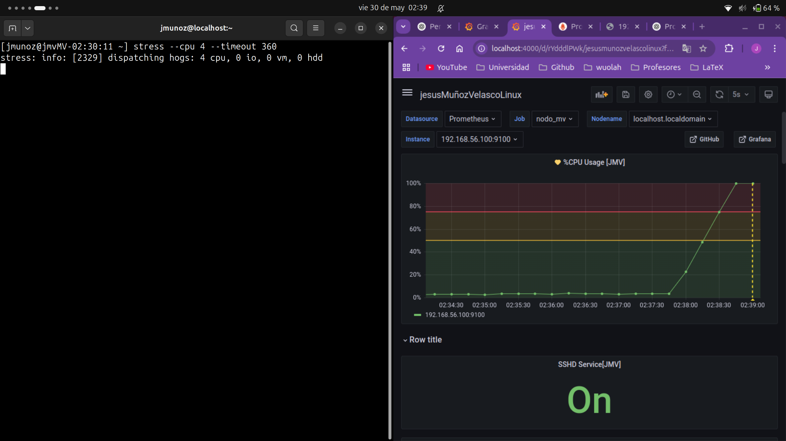
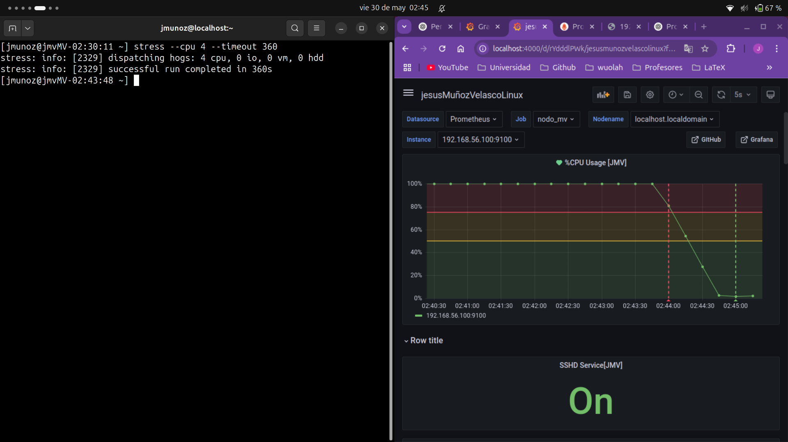

# Ejercicio Monitorización con Grafana+Prometheus

## Indicaciones
Se han hecho capturas de pantalla de todo el proceso y están adjuntas en una carpeta aparte (`images`). Durante el documento se referenciaran en qué imagenes aparecen las instrucciones que se usan. Se ha hecho así para facilitar la lectura y poder consultar cualquier duda en las imágenes. Se han indicado con (img_) donde '_' representa el número de imagen (ese será su nombre en el directorio recién mencionado). Se han adjuntado directamente además las que se piden de forma directa en los ejercicios.

## Monitorización de Servidor Linux

### Enunciado

Emplear la plataforma Prometheus + Grafana instalada para monitorizar las prestaciones de un servidor Rocky corriendo en una VM. El alumno/a puede elegir los componentes de Prometheus y Grafana que prefiera o crear nuevos componentes por si mismo/a. No obstante, se sugiere emplear como base el exporter de Linux para Prometheus, configurado como un servicio  y emplear como base algún dashboard predefinido para Grafana. Siga las instrucciones de cada dashboard para posibles ajustes en Prometheus. En Granafa vaya a
`Dashboards → Import` y proporcionar el `Id` del dashboard.


El dashboard debe recibir como identificador, el nombre y apellidos del alumno/a en CamelCase junto con el sufijo “Linux”. Por ejemplo, mariaGarciaPerezLinux. Todos los paneles creados se presentarán con un título que contenga las iniciales del alumno/a. Siguiendo con el ejemplo
anterior: %CPU (MGP).

El alumno/a debe extender el dashboard anterior para incorporar indicadores sobre el el nivel de activación (“Activo”/”Inactivo”, 1/0) de los servicios: SSHD y Apache Httpd en el equipo Linux monitorizado. 

Además, deberá agregar un nuevo panel sobre el nivel de uso total de la CPU en tanto por ciento (%). A este panel se le asociará una alarma para que se dispare cuando la media del uso de CPU supere el 75% de CPU durante 5 minutos. Ponga de manifiesto el funcionamiento de la alarma empleando alguna herramienta de carga de las vistas en clase (por ejemplo, `stress`).

Para poner de manifiesto el funcionamiento de la monitorización, se adjuntará una memoria en la
que se presenten:
- Descripción de la secuencia de pasos realizada para ejecutar el exporter de Linux. Con capturas de pantalla de los pasos seguidos para su ejecución y/o configuración.
- Capturas de pantalla de los monitores de Sshd y Httpd poniendo de manifiesto su comportamiento cuando los servicios están activos e inactivos.
Captura de pantalla del monitor de uso de CPU antes y después de lanzar la carga de CPU.
- Captura de pantalla del comando empleado para disparar la carga de CPU.
- Captura de pantalla que ponga de manifiesto el disparo de la alarma asociada al monitor de CPU

### Resolución

En primer lugar se ha instalado en la máquina virtual `wget` y se ha clonado el repositorio de github (img1, img2):
```bash
sudo dnf install wget
sudo wget https://github.com/prometheus/node_exporter/releases/download/v1.9.1/node_exporter-1.9.1.linux-amd64.tar.gz
```
Una vez descargado el archivo `node_exporter-1.9.1.linux-amd64.tar.gz`
se ha descargado `tar` y se ha extraído el contenido del archivo con (img3, img4) 
```bash
sudo dnf install tar
tar -xvf node_exporter-1.9.1.linux-amd64.tar.gz
```
Se ha creado a continuación un usuario nuevo sin terminal ni shell (img5), se le ha dado la propiedad del archivo descomprimido anteriormente (img6) y se ha cambiado el nombre del archivo a `node_exporter` (para facilitar su uso). Finalmente se le ha dado permiso de ejecución (img7)
```bash
useradd --no-create-home --shell /bin/false node_exporter
chown -R node_exporter:node_exporter /opt/node_exporter-1.9.1.linux-amd64
mv /opt/node_exporter-1.9.1.linux-amd64 /opt/node_exporter
chmod u+x /opt/node_exporter
```
Después se ha creado un servicio para el exporter y se ha añadido la información necesaria para el funcionamiento (img8, img9)
```bash
touch /etc/systemd/system/node_exporter.service
vi /etc/systemd/system/node_exporter.service
```
En el archivo se ha añadido el siguiente contenido (img10):
```bash
[Unit]
Description=Node Exporter
Wants=network-online.target
After=network-online.target

[Service]
User=node_exporter
Group=node_exporter
Typer=simple
ExecStart=/opt/node_exporter/node_exporter

[Install]
WantedBy=default.target
```
Una vez hecho esto se han recargado los demonios y se ha habilitado el nuevo servicio recién creado (img11)
```
systemctl daemon-reexec
systemctl daemon-reload
systemctl enable node_exporter
```

Se ha habilitado el puerto 9100 (img12)
```bash
firewall-cmd --permanent --add-port=9100/tcp
firewall-cmd --reload
```
Para que el exporter pueda ver la nueva información que se quiere recopilar se ha modificado una opción en su arranque. Para ello, en lugar de modificar el servicio creado se han añadido directrices (un parámetro para la ejecución). El proceso ha sido el siguiente (img13):
```bash
sudo mkdir -p /var/lib/node_exporter/textfile_collector
sudo systemctl edit node_exporter
```
Con esta última instrucción se nos abre un archivo al que se le va añadir la siguiente información (img14):
```bash
[Service]
ExecStart=
ExecStart=/usr/local/bin/node_exporter --collector.textfile.directory=/var/lib/node_exporter/textfile_collector
```

Se le ha dado la propiedad del `textfile_collector` al `node_exporter` y se han recargado los demonios y el servicio `node_exporter` (img15):
```bash
sudo chown node_exporter:node_exporter /var/lib/node_exporter/textfile_collector
sudo systemctl daemon-reexec
sudo systemctl restart node_exporter
```
Una vez hecho esto solo nos queda indicar qué parámetros queremos exportar. Para ello se ha modificado el archivo (img16)
```bash
sudo vi /usr/local/bin/check_services.sh
```
Y se ha añadido el siguiente contenido (img17):
```bash
#!/bin/bash

OUTPUT_FILE="/var/lib/node_exporter/textfile_collector/service_status.prom"

echo "# HELP service_up Whether a systemd service is up (1) or down (0)" > $OUTPUT_FILE
echo "# TYPE service_up gauge" >> $OUTPUT_FILE

for service in httpd sshd; do
    if systemctl is-active --quiet $service; then
        echo "service_up{service=\"$service\"} 1" >> $OUTPUT_FILE
    else 
        echo "service_up{service=\"$service\"} 0" >> $OUTPUT_FILE
    fi
done
```

Después le daremos la propiedad al `node_exporter` (img18) y permiso de ejecución:
```bash
sudo chmod u+x /usr/local/bin/check_services.sh
sudo chown node_exporter:node_exporter /var/lib/node_exporter/textfile_collector/service_status.prom
```

Con este script mandamos al archivo `service_status.prom` 4 líneas. Las 2 primeras son comentarios que ayudaran a otras tareas. Las 2 últimas serán de la forma:
```
service_up{service=httpd} *
service_up{service=httpd} *
```
Donde en '*' aparecerá un número (0 o 1) que indica si el servicio entre llaves está activo o no (es fácil de leer en el script).


Solo nos queda hacer que este script se ejecute periódicamente para poder comprobar de forma continua el estado de estos servicios. Para ello vamos a ejecutar los siguientes comandos (no tengo imagen de su ejecución):
```bash
sudo crontab -e
```
Y añadimos la siguiente línea al archivo:
```
* * * * * /usr/local/bin/check_services.sh
```
Con esto hacemos que el script anterior se ejecute cada minuto.
Una vez hecho esto ya hemos finalizado la configuración en la máquina virtual (el servidor que queremos monitorizar). Recargamos los demonios (img19)
```bash
systemctl daemon-reload
systemctl daemon-reexec
systemctl restart node_exporter
```
---
Una vez añadido el servicio de exporter de la máquina virtual se ha lanzado el `docker` del host (sobre el directorio `progra` creado de acuerdo a la documentación) (img20)
```bash
sudo docker compose up
```
Con esto ya tendremos disponible en el puerto 9090 Prometheus (img21) y en el puerto 4000 Grafana en `localhost`. Configuramos el `Data Source` en Grafana para que lea las métricas de Prometheus.

En Frafana podemos importar un dashboard a partir de su id. En mi caso he elegido el modelo con id `1860` (por ser bastante completo).

Ahora pasamos a añadir las dos nuevas métricas que nos pide el ejercicio. Para ello se añade un nuevo panel y en el Query que se despliega añadimos el siguiente código (img22):
```
service_up{service="sshd"}
```
En las métricas de la derecha podemos cambiar el título del panel y ponerle por ejemplo `SSHD Service [JMV]`. En Units podemos ponerlo de tipo `Bool`, en concreto `On/Off` para mejorar la visibilidad de la variable. Podemos también hacerlo de tipo `Stat` (para no ver una gráfica lineal sino únicamente el valor) y añadir thresolds para que se vea verde cuando esté activo y rojo cuando esté inactivo (img23). 

Si repetimos este proceso una vez más pero con el código 
```
service_up{service="httpd"}
```
podremos obtener una vista como la siguiente (img24):


Donde ya tenemos los paneles pedidos. Ahora podemos pasar a hacer pruebas en los servidores para comprobar si funcionan correctamente estos paneles. 

Comenzamos instalando `httpd` en el servidor (img25):
```bash
sudo dnf install httpd
```
Podemos ver que inicialmente el panel `Httpd Service [JMV]` se encuentra en estado `Off` (img26) :


Si ahora probamos a iniciar el servicio `httpd` obtenemos (img27): 
```bash
systemctl start httpd
```


Y vemos que efectivamente se activa el panel correspondiente.

Probamos ahora a desactivar el servicio `sshd` (img28):
```bash
systemctl stop sshd
```


Y vemos que efectivamente se desactiva.
Probamos nuevamente a desactivar también `httpd`
(img29):
```bash
systemctl stop httpd
```


Finalmente podemos activar los dos a la vez y tenemos el siguiente resultado (img30):
```bash
systemctl start httpd
systemctl start sshd
```


Vamos ahora con el panel para medir el uso de la CPU. Creamos un nuevo panel y añadimos el siguiente Query (img31):
```
100 - (avg by (instance) (rate(node_cpu_seconds_total{mode="idle"}[1m])) * 100)
```

Podemos tocar los tresholds de nuevo para darle un aspecto más atractivo. Finalizada la creación de este panel es hora de crear una alerta. Le damos a alerts y añadimos una nueva alerta (img32). 

Le indicamos la misma métrica que antes y en la expresión B añadimos
`WHEN last OF A IS ABOVE 75`. Una vez hecho esto terminamos de configurar la alerta poniéndole `Evaluate 1m for 5m` para que salte a los 5 min comprobándolo cada minuto. Podemos pasar ya a probar el panel y la alerta (img33). Ejecutamos en la máquina virtual:
```bash
stress --cpu 4 --timeout 360
```


Y vemos cómo empieza a subir el uso de la CPU en el panel recién creado. Si vemos un poco más observamos que cuando supera el 75% (línea roja) se dispara la alarma pero en estado `pending` (img34):



Ahora empezará a contar 5 minutos hasta que se cumpla la condición para que salte la alarma (img35):


Si lo dejamos un poco más vemos cómo de desactiva la alerta al volver a un uso bajo de la CPU (img36):



## Monitorización de API WEB

### Enunciado
La aplicación empleada en apartado anterior para la prueba de carga, expone en el path “/metrics” los indicadores de NodeJS para Prometheus. Para más información, el exporter de Prometheus de la API Web se ha generado empleando los componentes estandar: prom-client y express-prom-bundle.

Cree un nuevo Dashboard con algunas de las métricas expuestas. Para el dashboard emplee como nombre su nombre y apellidos en CamelCase seguido del sufijo API. Por ejemplo, anaTorrentRamonetAPI. Todos los paneles creados se presentarán con un título que contenga las iniciales del alumno/a. Siguiendo con el ejemplo anterior: %Memoria (ATR).

Cree un monitores para las siguientes métricas:
- Tiempos de respuesta de los endpoints de la API (http_request_duration_seconds_bucket)
- Memoria disponible (nodejs_heap_size_total_bytes) vs la usada actualmente
(nodejs_heap_size_used_bytes)
- Uso de CPU (process_cpu_seconds_total)
  
Realice una memoria de prácticas en la que se ponga de manifiesto la ejecución de la prueba de carga diseñada para Jmeter y se aprecie el efecto de la misma en los monitores anteriormente descritos.

## Resolución
