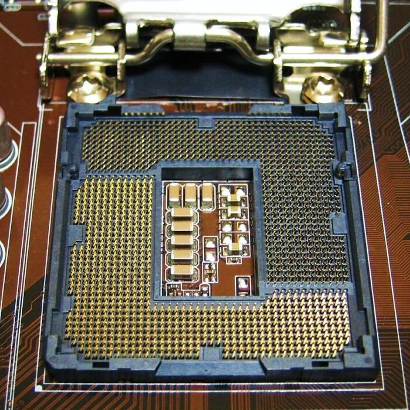
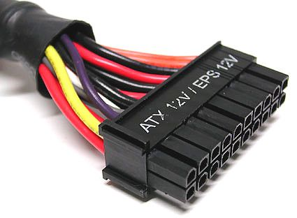
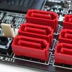

# Enero 2022

1. Decimos que un servidor es fiable si se encuentra en estado operativo.
    - ( ) Verdadero
    - (x) Falso
  
2. Podemos aumentar la escalabilidad de un servidor añadiendo fuentes de alimentación redundantes.
    - ( ) Verdadero
    - (x) Falso

3. Los procesadores para servidores suelen tener más canales de memoria que los de PC en la misma generación.
    - (x) Verdadero
    - ( ) Falso

4. Las unidades de estado sólido (SSD) son capaces de alcanzar anchos de banda superiores a los que el
protocolo SATA-3 puede proporcionar.
    - (x) Verdadero
    - ( ) Falso

5. El primer procesador con un conjunto de instrucciones de 64 bits lo diseñó AMD a principios de los 2000.
    - ( ) Verdadero
    - (x) Falso

6. La "S" del acrónimo SRAM es por Synchronous.
    - ( ) Verdadero
    - (x) Falso

7. Un mádulo de RAM con chips a los dos lados tiene dos rangos.
    - ( ) Verdadero
    - (x) Falso

8. Puedo conectar una tarjeta PCle 2.0 en un conector PCIe 4.0 de la placa base, pero no al revés.
    - ( ) Verdadero
    - (x) Falso

9. PCle 2.0 x4 tiene un ancho de banda de 2GB/s en cada sentido.
    - (x) Verdadero
    - ( ) Falso

10. Puedo conectar un disco SATA usando el controlador SAS de la placa, pero no un disco SAS usando el controlador SATA de la placa.
    - (x) Verdadero
    - ( ) Falso

11. Una celda básica SRAM tiene más componentes electrónicos que una DRAM.
    - (x) Verdadero
    - ( ) Falso

12. AMD ofrece los procesadores EPYC para el mercado de sobremesa y OPTERON para servidor.
    - ( ) Verdadero
    - (x) Falso

13. SO-DIMM es un tipo de memoria pensada para servidores.
    - ( ) Verdadero
    - (x) Falso

14. En la jerarquía de memoria de un computador, la memoria LLC tiene menor latencia que la DRAM.
    - (x) Verdadero
    - ( ) Falso

15. El conjunto de instrucciones que ejecutan el auto-test de arranque (Power On self-test) se encuentran almacenadas en la ROM/Flash BIOS de la placa.
    - (x) Verdadero
    - ( ) Falso

16. Es el propio microprocesador de muchas placas base actuales el que realiza la función de puente norte del chipset.
    - (x) Verdadero
    - ( ) Falso

17. Para diagnosticar que una memoria RAM funciona correctamente debemos utilizar un benchmark específico para memorias RAM.
    - ( ) Verdadero
    - (x) Falso

18. Si NT >> NT* el servidor dejará de estar en equilibrio de flujo (para el caso de redes de colas cerradas).
    - ( ) Verdadero
    - (x) Falso

19. La sección de garantías de un pliego de prescripciones se refiere esencialmente a la garantía en la realización del pago del contrato.
    - ( ) Verdadero
    - (x) Falso

20. En un anuncio de licitación pública se debe aportar tanto los códigos CPV como la dirección de internet en la que estará disponible el pliego de condiciones.
    - (x) Verdadero
    - ( ) Falso

# Febrero 2022

1. Si un módulo de DRAM tiene chips en ambas caras se denomina módulo con 2 rangos.
    - ( ) Verdadero
    - (x) Falso

2. Un módulo de DRAM DDR4 con ECC 2Rx4 tiene 36 chips.
    - (x) Verdadero
    - ( ) Falso

3. Las tarjetas que usaban las ranuras ISA tenían que ser pre-configuradas para asignarles la interrupción que correspondía a cada una.
    - (x) Verdadero
    - ( ) Falso

4. Podemos mejorar la escalabilidad de un servidor utilizando RAID 1.
    - ( ) Verdadero
    - (x) Falso

5. Si una interfaz es Plug and Play podemos cambiar el componente en caliente (sin reiniciar).
    - ( ) Verdadero
    - (x) Falso

6. Un SSD con MLC es menos fiable que uno SLC.
    - (x) Verdadero
    - ( ) Falso

7. Un disco SAS usa un único conector que unifica tanto los cables de alimentación procedentes de la fuente de alimentación como los de datos, procedentes de la placa base.
    - (x) Verdadero
    - ( ) Falso

8. Los chips de la serie AMD Opteron X son SoC.
    - (x) Verdadero
    - ( ) Falso

9. AGP tiene más ancho de banda que PCI.
    - (x) Verdadero
    - ( ) Falso

10. Con la Ley de Amdahl podemos estimar la ganancia en velocidad de la ejecución un único trabajo (un hilo) en un computador después de mejorar k veces un componente.
    - (x) Verdadero
    - ( ) Falso

11. Las prestaciones de un servidor no se ven afectadas por la configuración de la memoria virtual.
    - ( ) Verdadero
    - (x) Falso

12. La ganancia en velocidad siempre es un número comprendido entre 0 y 2, ambos inclusive.
    - ( ) Verdadero
    - (x) Falso

13. Es poco frecuente que las placas de servidores tengan conectores VGA en el panel trasero.
    - ( ) Verdadero
    - (x) Falso

14. El protocolo USB 2.0 es half-duplex.
    - (x) Verdadero
    - ( ) Falso

15. El puente sur del chipset es el encargado de las transferencias entre el puente norte y el resto de periféricos con menores exigencias de velocidad de la placa.
    - (x) Verdadero
    - ( ) Falso

16. En un test t, el valor-p equivale esencialmente a la probabilidad de que la hipótesis nula sea falsa.
    - ( ) Verdadero
    - (x) Falso

17. a hipótesis de partida de un test ANOVA es que el factor que se está estudiando influye en el rendimiento.
    - ( ) Verdadero
    - (x) Falso

18. Con "sar -u", sin más argumentos, iremos obteniendo la información de la utilización global del procesador desde el momento actual en adelante.
    - ( ) Verdadero
    - (x) Falso

19. Un microbenchmark también suele denominarse benchmark de sistema completo.
    - ( ) Verdadero
    - (x) Falso

20. Si la suma de las utilizaciones de los dispositivos de un servidor es mayor que 1, el servidor está saturado.
    - ( ) Verdadero
    - (x) Falso

# Enero 2023

1. Una ganancia (speedup) negativa quiere decir que la mejora aplicada ha empeorado el tiempo original.
    - ( ) Verdadero
    - (x) Falso

2. EPYC es una familia de procesadores de AMD para servidores.
    - (x) Verdadero
    - ( ) Falso

3. eDonkeyes un ejemplo de Arquitectura Cliente/Servidor de varios niveles.
    - ( ) Verdadero
    - (x) Falso

4. El zócalo para CPU de la figura es de tipo LGA.  
    - (x) Verdadero
    - ( ) Falso

5. Es mejor comprar un servidor con una relación prestaciones/coste con un valor inferior a la de otro servidor.
    - ( ) Verdadero
    - (x) Falso

6. AHCI es una interfaz diseñada para facilitar la conexión de SSD a través de PCIe.
    - ( ) Verdadero
    - (x) Falso

7. Un microprocesador puede acceder simultáneamente a dos módulos de memoria DRAM solo si están en canales diferentes.
    - (x) Verdadero
    - ( ) Falso

8. En una placa base de un PC es habitual encontrar tanto conectores SATA como SAS.
    - ( ) Verdadero
    - (x) Falso

9. La transmisión de información entre un módulo de memoria de tipo DDR4 y la CPU es half-duplex.
    - (x) Verdadero
    - ( ) Falso

10. El módulo regulador de voltaje, entre otras cosas, convierte la corriente alterna en corriente continua.
    - ( ) Verdadero
    - (x) Falso

11. SATA-3 usa codificación 128b/130b.
    - ( ) Verdadero
    - (x) Falso

12. La precisión de un sensor se refiere esencialmente a cómo se aproximan las medidas que toma al valor verdadero.
    - ( ) Verdadero
    - (x) Falso

13. Todos los protocolos de comunicación serie son full-duplex.
    - ( ) Verdadero
    - (x) Falso

14. Es frecuente que las placas de servidores tengan un conector VGA en el panel trasero.
    - (x) Verdadero
    - ( ) Falso

15. La utilidad principal de las unidades de cinta en servidores es para almacenamiento de respaldo (backup) y archivado.
    - (x) Verdadero
    - ( ) Falso

16. PCIe permite la conexión serie punto a punto, una comunicación de tipo full-duplex y la conexión de dispositivos en caliente.
    - (x) Verdadero
    - ( ) Falso

17. En un pliego de prescripciones técnicas no se debe hacer referencia a una fabricación o una procedencia determinada con la finalidad de favorecer o descartar ciertas empresas o ciertos productos. Si no es posible, se acompañará la mención «o equivalente».
    - (x) Verdadero
    - ( ) Falso

18. En un test ANOVA, si Fexp es mayor que el grado de significatividad concluiremos que no podemos decir que el factor a considerar influya en la variable respuesta.
    - ( ) Verdadero
    - (x) Falso

19. gprofbasa su información en lo que obtiene leyendo de /proc.
    - ( ) Verdadero
    - (x) Falso

20. El contratante es el licitador que resulta adjudicatario de la licitación y quien finalmente se encargará de llevar a cabo los trabajos contratados.
    - ( ) Verdadero
    - (x) Falso

# Febrero 2023

1. Los procesadores Intel Core i7 están especialmente diseñados para placas con dos o más zócalos de CPU.
    - ( ) Verdadero
    - (x) Falso

2. Una memoria DRAM
    - ( ) Verdadero
    - (x) Falso

3. Si  \\(\sum\limits_{i=1}^{K} U_i > 1\\) el servidor está saturado.
    - ( ) Verdadero
    - (x) Falso

4. El conector de la figura de la derecha proviene de una fuente de alimentación.  
    - (x) Verdadero
    - ( ) Falso

5. El índice SPEC premia mejoras sustanciales con respecto a algún programa del benchmark y no castiga al mismo nivel los empeoramientos.
    - (x) Verdadero
    - ( ) Falso

6. Puedo conectar un disco SATA en una placa base que tenga conectores SAS.
    - (x) Verdadero
    - ( ) Falso

7. La razón media de visita de un dispositivo no tiene por qué ser necesariamente un número entero no negativo. 
Nota: números enteros no negativos son: \\(0, 1, 2, 3, \dots\\)
    - (x) Verdadero
    - ( ) Falso

8. El pliego de prescripciones técnicas debe contener, con carácter general, la información sobre el plazo de ejecución
o duración del contrato.
    - ( ) Verdadero
    - (x) Falso

9. La expresión \\(Wi=Ni \cdot Si\\) es una ley operacional.
    - ( ) Verdadero
    - (x) Falso

10.  En la monitorización de un servidor durante un tiempo T, CO no puede ser mayor que A0.
    - ( ) Verdadero
    - (x) Falso

11.  \\(R_i=W_i+Q_i\\), para todo \\(i=1..K\\)
    - ( ) Verdadero
    - (x) Falso

12.  La versión serie del interfaz SCSI se llama SAS, cuyas siglas provienen de "Serial Attached SCSI".
    - (x) Verdadero
    - ( ) Falso

13.  Una red de colas abierta se puede considerar un caso particular de red de colas cerrada si hacemos que \\(Z = 0s\\).
    - ( ) Verdadero
    - (x) Falso

14.  El pliego de condiciones se divide en "pliego de cláusulas administrativas particulares" y "pliego de prescripciones técnicas".
    - (x) Verdadero
    - ( ) Falso

15.  AMD ofrece los procesadores EPYC para el mercado de sobremesa y los OPTERON para el de servidores.
    - ( ) Verdadero
    - (x) Falso

16.  La cola/pasta térmica es un aislante que evita que el calor salga de la CPU.
    - ( ) Verdadero
    - (x) Falso

17.  Las SSD tienen menor latencia que los discos duros debido a que, entre otras cosas, no tienen que esperar a que el cabezal se posicione sobre la pista a leer/escribir.
    - (x) Verdadero
    - ( ) Falso

18. Las LR-DIMM se utilizan para caché de altas prestaciones en servidores.
    - ( ) Verdadero
    - (x) Falso

19. Es el propio microprocesador en muchos computadores actuales el que realiza la función de puente norte del chipset.
    - (x) Verdadero
    - ( ) Falso

20. El fenómeno llamado "timing skew" motivó la aparición de protocolos de comunicación paralelos como P-ATA (también llamado IDE) o PCI.
    - ( ) Verdadero
    - (x) Falso

21. Existen servidores con fuentes de alimentación reemplazables en caliente (hot swappable).
    - (x) Verdadero
    - ( ) Falso

22. Las primeras instrucciones que ejecuta un procesador en el arranque proceden de las primeras direcciones de la DRAM.
    - ( ) Verdadero
    - (x) Falso

23. Las pistas en una placa base están hechas de una resina no conductora y no inflamable.
    - ( ) Verdadero
    - (x) Falso

24. Una de las líneas del protocolo PCIe se usa en exclusiva para transmitir la señal de reloj.
    - ( ) Verdadero
    - (x) Falso

25. Los conectores de la placa base de la figura de la derecha podrían ser de tipo SATA.  
    - (x) Verdadero
    - ( ) Falso

# Enero 2024

1. Un servidor que siempre me da respuesta, pero que a veces me da respuestas incorrectas, tiene una disponibilidad del 100%.
    - (x) Verdadero
    - ( ) Falso

2. Con “sar -P 1” puedo conocer el estado del proceso con id=1.
    - ( ) Verdadero
    - (x) Falso

3. Cuando nos referimos al método USE para la monitorización del rendimiento de un servidor, la “S” de USE viene de “Saturation”.
    - (x) Verdadero
    - ( ) Falso

4. Un zócalo PGA tiene agujeritos para que entren las palillas del procesador.
    - (x) Verdadero
    - ( ) Falso

5. Una celda SRAM tiene más componentes electrónicos (condensadores, transistores...) que una DRAM.
    - (x) Verdadero
    - ( ) Falso

6. Un microprocesador puede acceder a la vez a dos módulos de memoria del banco de un mismo canal.
    - ( ) Verdadero
    - (x) Falso

7. PCle 5.0 usa codificación 8b/10b.
    - ( ) Verdadero
    - (x) Falso

8. No solo se puede conectar una tarjeta PCIe 2.0 en una ranura PCIe 5.0 de la placa base, sino que también se
puede conectar una tarjeta PCIe 5.0 en una ranura PCle 2.0 de la placa base.
    - (x) Verdadero
    - ( ) Falso

9. A través del System Panel (o Front Panel) se puede conectar un dispositivo USB del chasis a la placa base.
    - ( ) Verdadero
    - (x) Falso

10. Las placas de servidores suelen tener un conector VGA en el panel trasero.
    - (x) Verdadero
    - ( ) Falso

11. \\(N_0 = \sum\limits_{i=1}^K V_i \times N_i \\)
    - ( ) Verdadero
    - (x) Falso

12. Los pliegos de prescripciones técnicas en ningún caso contendrán declaraciones o cláusulas que deban figurar en el pliego de cláusulas administrativas particulares.
    - (x) Verdadero
    - ( ) Falso

# Febrero 2024

1. A la hora de escoger un servidor ateniéndonos únicamente al valor de la relación prestaciones/coste, es mejor escoger la versión con un valor numérico mayor.
    - (x) Verdadero
    - ( ) Falso

2. Los procesadores Intel Core están especialmente diseñados para placas con dos o más zócalos de CPU.
    - ( ) Verdadero
    - (x) Falso

3. La primera arquitectura comercial de procesadores de 64 bits surgió en 2003 de la mano de AMD.
    - ( ) Verdadero
    - (x) Falso

4. Una memoria DRAM necesita refresco porque es volátil.
    - ( ) Verdadero
    - (x) Falso

5. Decimos que un módulo de DRAM tiene dos rangos si tiene chips por las dos caras.
    - ( ) Verdadero
    - (x) Falso

6. NCQ (Native Command Queuing) es una extensión de SATA concebida especialmente para optimizar el acceso a unidades de estado sólido.
    - ( ) Verdadero
    - (x) Falso

7. Una de las líneas del protocolo PCIe se usa en exclusiva para transmitir la señal de reloj.
    - ( ) Verdadero
    - (x) Falso

8. El puente sur del chipset se encarga de las líneas de PCIe x16.
    - ( ) Verdadero
    - (x) Falso

9. Un determinado monitor software por muestreo se activa cada 5s. Cada activación del monitor (para medir lo que tenga que medir) requiere un total de 6 ms de uso de la única CPU de nuestro servidor. Entonces, la sobrecarga de CPU del monitor será 0,0012%.
    - ( ) Verdadero
    - (x) Falso

10. La precisión de un sensor está relacionada con la dispersión de las medidas que realiza.
    - (x) Verdadero
    - ( ) Falso

11. El indice SPEC no tiene unidades.
    - (x) Verdadero
    - ( ) Falso

12. El pliego de prescripciones técnicas debe contener, con carácter general, la información sobre el plazo de ejecución o duración del contrato.
    - ( ) Verdadero
    - (x) Falso

